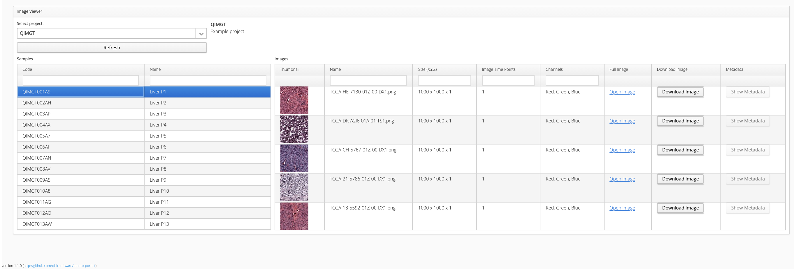

# OMERO visualisation portlet

OMERO image visualisation portlet - A Vaadin app for visualising image data in qPortal.

## Author

Created by Luis Kuhn Cuellar (luis.kuhn@qbic.uni-tuebingen.de).

## Description

### Purpose of the portlet

The large volume of data produced by various omics disciplines (e.g. genomics, transcriptomics, proteomics, metabolomics), biomedical imaging techniques (e.g. X-ray CT and PET), and the unprecedented increase in spatial resolution achieved by conventional confocal and super-resolution light microscopy and modern electron microscopes present a challenge for long-term storage and management of these high-dimensional digital assets. Itt is of particular importance to employ rich metadata models that allow researchers to relate data from different disciplines, and design experiments using an integrative approach to handle both, multilayer omics, as well as biomedical imaging data. The integration of metadata from multi-omics experiments together with imaging metadata is an integral step in discovering new insights. 

This portlet provides users with an interface that facilitates retrieval of metadata, both from experimental design and associated images.

### Functionality

This application provides easy access to imaging metadata and image visualization, using the *OMERO Client* component to query the OMERO server. This portlet also accesses OMERO.web functionality, in particular the 5D image viewers. 

For images that were uploaded in a proprietary format, this portlet enables the user to download images from the OMERO server  in the open [`OME-TIFF`](https://github.com/ome/ome-model/blob/master/docs/sphinx/ome-tiff/index.rst) format.

The problem of association with experimental metadata is solved by integration of imaging information with metadata stored in the openBIS instance. Thus enabeling scientists to associate image infromation with their projects.

## How to Install

The `omero-portlet` does provide a comprehensive user interface for scientists to interact with their imaging data. For the portlet to run three other main components are required. First the Liferay portal, this portal provides basic functionality for portlet deployment. The second dependency is the OMERO server itself. OMERO offers a platform to store and retrieve imaging data on request. This imaging solution is integrated in our infrastructure and connected to an openBIS data management instance using ETL routines. Information on the ETL routines can be found in section [ETL routine](#etl-routine). 

Instructions on setting up the Liferay portal, openBIS and OMERO are located in section [Setting up the portal](#setting-up-the-portal).

### Setting up the portal

This application is part of an extension to [qPortal](https://journals.plos.org/plosone/article?id=10.1371/journal.pone.0191603). For specific instructions and configuration details on the infrastructure setup please refer to the [instructions on our portal](https://portal.qbic.uni-tuebingen.de/portal/web/qbic/software#instructions).

This portlet requires a qPortal environment, which has as a prerequisite the following environment:

1. A portal running on [Liferay](https://www.liferay.com/de/home). Our portal has been tested on [Liferay 6.2 bundled with Tomcat](http://www.liferay.com/downloads/liferay-portal/available-releases).
2. An [OpenBIS](https://openbis.ch/) server (biological data management system). 
3. An OMERO server instance, this software is currently compatible with version [5.4.10](https://docs.openmicroscopy.org/omero/5.4.10/). 
4. We are using an additional MySQL database to store metadata, such as project investigators and their affiliations, as well as longer project descriptions. See the [instructions on our portal](https://portal.qbic.uni-tuebingen.de/portal/web/qbic/software#instructions).

The source code of the portlets which are part of qPortal can be found in our github [repository](https://github.com/qbicsoftware). Detailed information on how to use the provided portlets can also be found in the corresponding repositories.

The following are directly related portlets:
1. [qbrowser](https://github.com/qbicsoftware/projectwizard)
2. [qWizard](https://github.com/qbicsoftware/qnavigator)

### ETL routine

Here at QBiC we use automated ETL routines to register data. These routines produce quality measures to ensure that the data uploaded meets our standard. Further information on the ETL routines can be found in our [open source ETL repository](https://github.com/qbicsoftware/etl-scripts#etl-openbis-dropboxes). 
